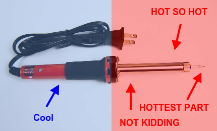

# Step 1: Lab Safety

!!! danger "ALCOHOL CAN CATCH FIRE!"

    Keep it away from sources of heat, including the solder iron. Failure to
    do so may result in fire, or worse!

    - After cleaning, make sure to remove all alcohol from the board
      before continuing to solder.

!!! danger "MOLTEN SOLDER CAN SPLASH IN YOUR FACE!"

    - Wear safety goggles while working to make sure nothing gets in your
      eyes.

      INSERT PICTURE OF FAILING TO COMPLY

    - Don't put your head too close to the board while soldering to
      avoid solder splash getting in your face.

      INSERT PICTURE OF FAILING TO COMPLY 

!!! danger "SOLDERING IRONS ARE HOT!"

    Soldering irons operate at CRAZY temperatures\! The handle on the iron
    can get hot. That's okay, but **DO NOT EVER TOUCH** the rest of it. It
    is **extremely hot** and will burn a lot\!

    

    - Don't touch the hot part, **YOU WILL GET BURNED**.

      INSERT PICTURE OF FAILING TO COMPLY

    - Always put the soldering iron back on it's stand and turn it
      off before getting up from your workstation.

      INSERT PICTURE OF FAILING TO COMPLY 

    - Do not play or roughhouse where a soldering iron is in use.

      INSERT PICTURE OF FAILING TO COMPLY

    - **Do not** reach across an
      area where an iron is being used. Go around.

      INSERT PICTURE OF FAILING TO COMPLY 

!!! warning "SOLDER FUMES ARE NASTY!"

    - Always work in a well-ventilated place area, with the air
      conditioning on.

      INSERT PICTURE OF FAILING TO COMPLY

    - If available, working outside is also an option.

      INSERT PICTURE OF SOLDERING IN THE SUNSHINE 

    - A small fan or air filter can help reduce solder fumes.

      INSERT PICTURE OF FUME EXTRACTOR.

    - [An N95 mask may help](../../hardware/tools#mask)

!!! danger "ELECTRICITY CAN SHOCK YOU!"

    - Never leave power connected while soldering. This may result in
      electric shock.

!!! danger "WIRE TRIMMINGS CAN GO FLYING!"

    The little clippings from the lead wires WILL go flying if you let them.

    INSERT FAILING TO COMPLY

    1.  ALWAYS cup your hand around the leads your cutting so that you can
        catch the trimmings.

        INSERT PICTURE OF HAND POSITION 

    2.  ALWAYS wear your safety goggles while working.

        INSERT WEARING GOGGLES 

    3.  If a wire does get away, ALWAYS make sure to pick it up so that no
        one steps on it later.
        INSERTING PICTURE OF GETTING UP AND FINDING LOOSE TRIMMINGS 
