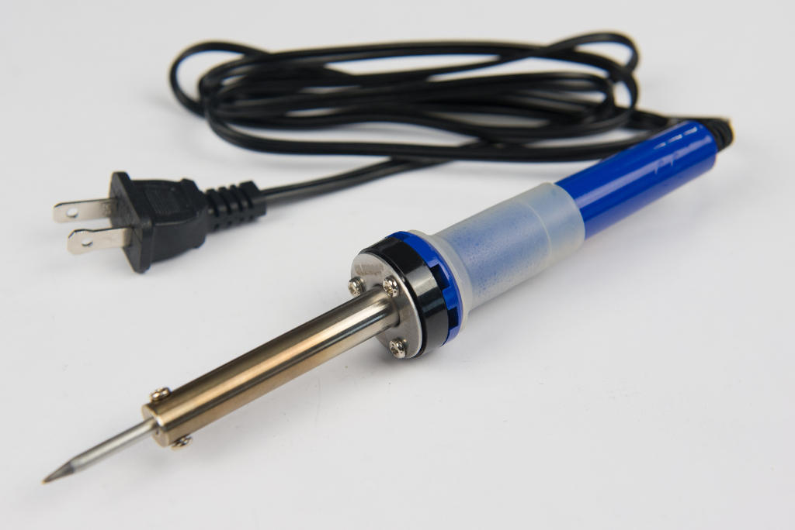
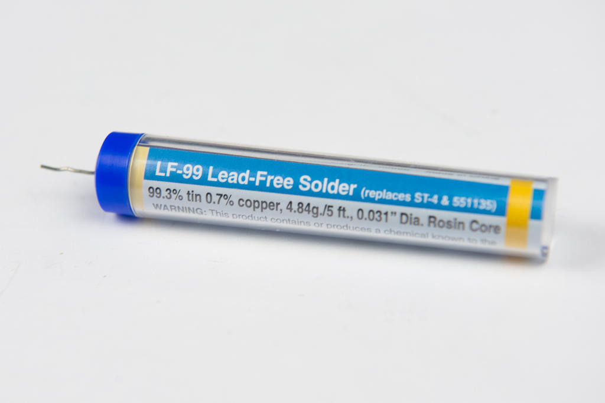
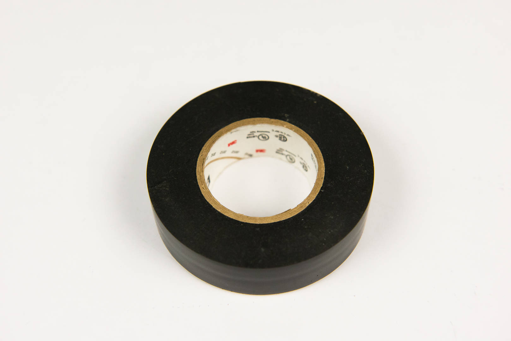
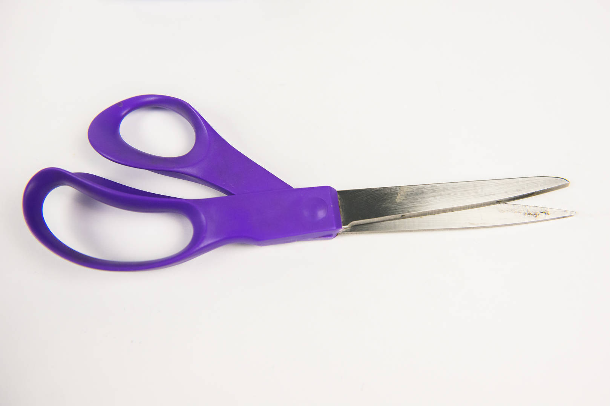
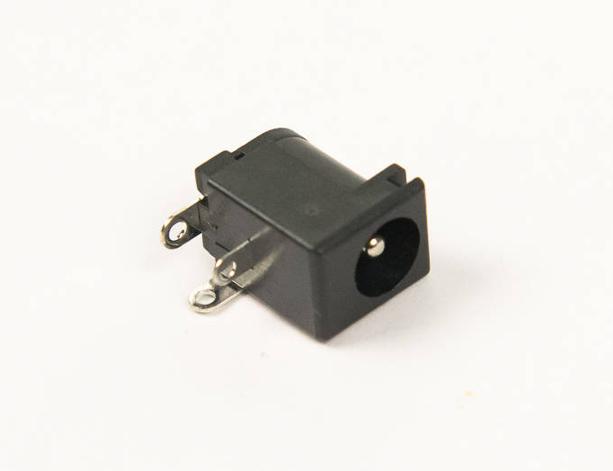

# Step 3: Soldering

In this section, we show you how this manual works by having you solder
your first component onto the board.

## Reading This Manual

Each Step page follows roughly the same outline.

- First, a list of tools needed to the complete the section.
- Second, the parts to be attached.
- Third, the instructions for part using said tools.

It's all quite nice.

!!! summary "Step Example"

    **Step Blah: Adding the Blah**

    Today we're going to blah blah blah...

    **Tools Needed**

      - Blah blah ...

    **Parts Needed**

      - 1 x blah ...

    **Instructions**

    1.  First you blah ...

## Tools Needed

So what is a soldering iron anyway? It's a boring way to say a super
hot, several hundred degree pen that can put a hole in your table in an
instant\! YEAH\!

Operating by the same principles as your toaster, it's literally like
plugging in all the power from your wall outlet and concentrating it
into one tiny point.

But why do something so awesome? Well, here's where it gets even
cooler. **A soldering iron is used to fuse two metal things
together\!** It does this by melting a small amount of metal (in this
kit, primarily tin), in between the two surfaces. This metal that we
melt is called **solder**.

INSERT DIAGRAM OF SOLDER FILLING METAL JOINTS

### Soldering Iron

{: width=400}

### Solder

{: width=400}

You'll discover pretty quickly that
it can be next to impossible to get components to stay on the board
while soldering. You can try lots of different things. You can:

- Try to sandwich your board between two large objects somehow.
- Try to press your board on the table just right.
- Try to use those weird helping hands things, or a vice or something.
- Some other thing.

INSERT PICTURES OF UNSUCCESSFUL SOLDERING POSITIONING ATTEMPTS

This is a matter of personal preference, but I find all of those things
to be more trouble than they're worth, when you can literally just tape
the component to the board and have it stay there without any
complaints.

So that's what I do now. I just tape it to the board, and everyone's
happy. Everyone being me, of course.

Oh, and you'll probably need scissors to cut the tape. Just saying...

### Electrical Tape

{: width=400}

### Scissors

{: width=400}

## Parts Needed

- 1 x DC barrel jack

  {: width=200}

- 1 x Board

  

## Instructions

1.  Unroll the plastic component bag labeled "**1 & 2: Power**", and
    find the DC barrel jack, as pictured above. All parts are organized
    in bags in the order in which they are used during assembly.

2.  A footprint is a white outline that helps specify where certain
    parts are intended to fit and how. Find the footprint for this
    component. Each footprint has a tiny label on the board next to it.
    This barrel jack goes into **J1**, so look for it. Most components
    are on the back, with a few special ones in front.
    

3.  You always want to solder the component onto the side with the
    footprint, otherwise it will be wrong, may not work, or worse.
    

4.  Cut yourself some electrical tape to hold components in place.
    You'll be able to use this over and over again, so cut a good
    amount. Not too short that it won't stick, but not too long that it
    gets in the way.

    !!! important "Only use electrical tape"

        Other tapes may leave sticky residue or melt while soldering.

    

5.  Tape the barrel jack to the board. Make sure it sticks on both sides
    so that the barrel jack stays flat, or flush with, the board when
    you flip it over. If it isn't flat against the board, and you begin
    to solder it, it's going to be next to impossible to fix, so there
    will always be a gap. So make sure it's flat **before** you start to
    solder.
    

6.  Flip the board over. Now you're going to solder the DC barrel jack
    into **J1**. Soldering is tricky. It's tempting to use the iron to
    melt the solder directly, but that doesn't work very well, as it
    burns off the flux in the solder, leaving none left to clean the
    surface of the board to improve solder wetting.  Make sure to hold
    the iron flat so that the tip is flat against the metal on the
    board. So don't do that\! Instead, use the iron to heat the metal
    pad on the board, then start melting the solder onto the board. This
    will ensure that the solder is able to bond with both surfaces.
    INSERT PICTURE OF HOLDING IRON FLAT AGAINST BOARD

7.  
    
    Solder doesn't always have to have a shiny finish. In fact, some
    solders, like lead-free, it's very difficult to do so. It may end up
    having more of a frosted-looking finish than metallic, and that's
    okay, as long as it has a good shape and is properly adhered to the
    board.
    INSERT PICTURE OF SHINY
    FINISH
    INSERT PICTURE OF NOT
    SO SHINY FINISH
    Don't worry, guys\! It
    doesn't have to be perfect\!

### Ground Connections

You may not know which pins are connected to ground just by looking at
it (you might need to resort to the schematic to know that), but you
will certainly know when you encounter one. Ground-connected pins have
lots of metal connected to them, so they're very difficult to heat up.
You will experience an unusual amount of trouble getting the solder to
heat and stay heated.

Some pins will be harder to solder than others, for a number of reasons.
Some are connected to more metal, bigger parts

In this case, the smallest hole on this connector, near the front, is
connected to ground. Hence, it will be the most difficult to solder.

But don't give up\! Just hold the iron to the pin longer until the
solder flows. It will eventually; it just might take a bit longer. And
remember, the longer the iron touches the board, the hotter the board
gets, so **be careful** touching the board after the iron has an
extended stay.
