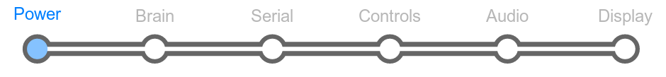
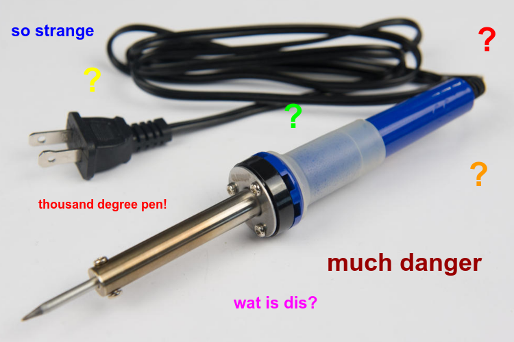

# Section 1: Start

Here, we introduce the basics of soldering by adding our very
first component to the LameStation, the power jack.

There's a good possibility that if you are sitting in front of your
unassembled LameStation right now and have never soldered before, the
soldering iron is looking pretty terrifying.

Good thing is, you're not alone.

I know that's how I felt when I first started this project, because
let's face it. This is what we know about soldering irons at this point:

- They're hot.
- They melt metal.
- You have to hold them.

Like a curling iron left plugged in on the sink, this sounds like a
recipe for disaster. But unlike a curling iron, we need to get some
things straight\!

## Ground Rules

To ensure we get off on the right foot, we need to set some ground rules:

!!! danger "Rule #1: Be Careful!"

    **Soldering Irons Are HOT.** If you aren't paying attention,
    you may burn yourself, and it will hurt. Or worse, you may burn someone
    else.

!!! danger "Rule #2: Be Careful!!"

    **Electronics assembly is like surgery**. If you make a
    mistake, your LamePatient could die. Check twice, and solder once\!

!!! danger "Rule #3: See Rules 1 and 2."

    **Totally not joking.** They say that "soldering safety is self-taught"
    for a reason.

Okay, now that we have that out of the way, we can start something. In
this section, we're going to walk you through setting up your
workstation, setting the iron, soldering your first component, and
cleaning up afterwards. When finished, you will have your first
experience of how solder actually flows through a joint and how it
behaves.

We start with the power jack because it's a big component that's all
metal, so it's hard to damage. As we progress through the sections, we
will handle smaller and more fragile components, but by the time we get
there, you'll be better equipped to handle them.

## Parts Needed

- 1 x DC power jack
