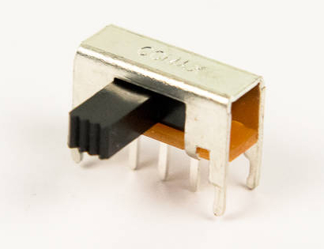

# Step 1: Power Switch

You will be installing the power switch. This switch opens and closes
the LameStation circuit.

When the circuit is **closed**, electrical current can flow, so the
power is turned on.

When the circuit is **open**, no electrical current can get through, so
power is not consumed, and the device is off.

## Tools Needed

- Soldering iron

## Parts Needed

- 1 x Power switch

  {: width=200}

## Instructions

!!! warning "Don't touch components after soldering! They will be HOT!"

1.  Find the **SW1** footprint, next to the power jack.
    

2.  Insert the sliding switch.

    !!! info panel

        Some components, like this one, won't be flush with the edge of the
        board; _that's okay_\! If it fits in the footprint, and it's on the
        correct side of the board, you're good to go.

    

3.  Solder the switch into place.

    
