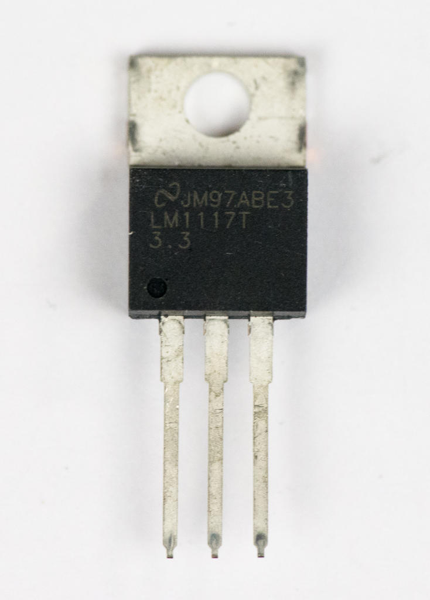
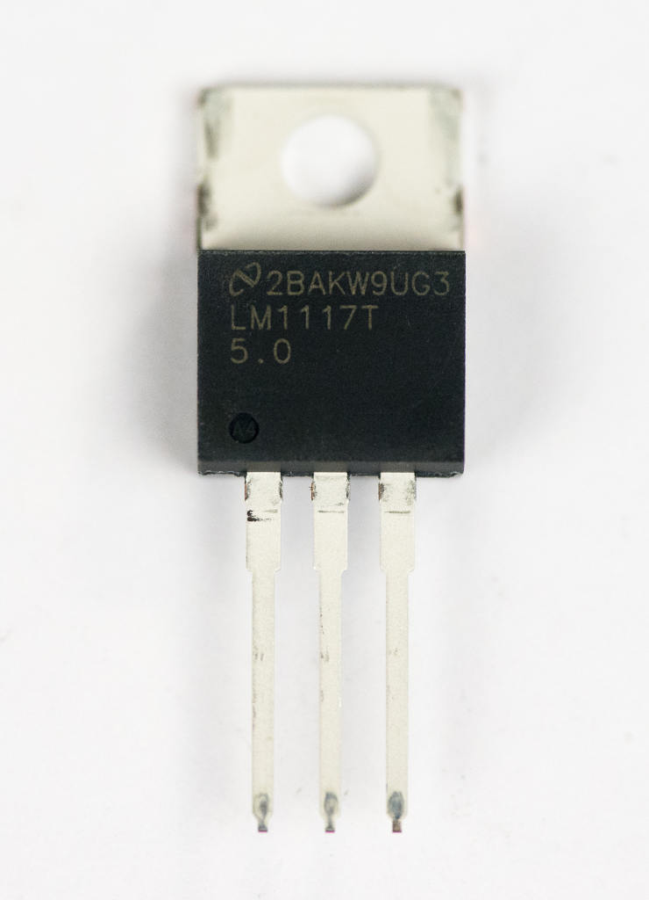
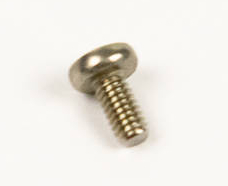
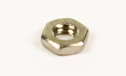

# Step 2: Regulators

What is a regulator? What is a heatsink?

## Tools Needed

- Soldering iron
- Cutter

## Parts Needed

- 1 x LM1117 3.3V regulator

  {: width=150}

- 1 x LM1117 5V regulator

  {: width=150}

- 2 x Screw

  {: width=100}

- 2 x Nut

  {: width=200}

## Instructions

1.  You will be installing 3.3V and 5V regulators. You can tell them
    apart by reading the small print directly on the chip. The 3.3V
    version is pictured, and says "`3.3`".

    !!! danger "Read the regulators carefully!"

        They look almost exactly the same, but they're not\! If you install
        them in the wrong locations, your LameStation will not work properly
        and it will be very time-consuming and difficult to fix.

2.  Find the footprint for the 3.3V regulator at **U3**.
    

3.  Insert the regulator.
    

4.  Slowly bend the regulator backwards so that it's flat against the
    board.
    
    
    

5.  Line up the regulator with the screw holes in the board, then insert
    a screw. It may take some wiggling to get the holes to line up.
    

6.  Thread the nut onto the screw on the other side.
    

7.  Hold the nut while gently tightening the screw with a screwdriver.
    

8.  Repeat steps 1-6 for the 5V regulator in **U2**.
    

9.  Now that your regulators are secure against the board, solder them
    into place.

    !!! tip "Give the iron time to heat the joint"

        These power pins have thicker wires, making them harder to heat up.

    

10. Now you've got lots of annoying wires sticking out the back of the
    board. Use **wire cutters** (or scissors, if you can't find wire
    cutters).

    !!! warning "Cut wires can have sharp edges"

        Be careful when holding the LameStation during assembly.

    
