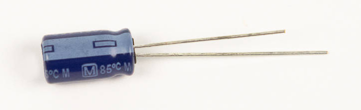

# Step 3: Capacitors

We will now be installing
three **100μF** **capacitors** into **C3**, **C4**, and **C5**.

WHAT IS AN ELECTROLYTIC CAPACITOR?

## Tools Needed

- Soldering iron
- Cutter

## Parts Needed 

- 3 x 100μF capacitors

  {: width=200}

## Instructions

1.  Find the footprints on the board. These are right next to the
    regulators that we just installed.

    

2.  These capacitors are **polarized**, which means they have to be
    inserted in a certain direction to work right.

    !!! danger "Do not insert the capacitor backwards"

        This type of capacitor may **burst** when the LameStation is powered
        if installed incorrectly.

    You can determine the positive and negative terminals by looking at
    the body of the capacitor. On the side of one of the pins, you will
    find a strip of minus signs printed on the side. This is the
    negative terminal.

    

    You can also tell by the length of the capacitor **leads**, or the
    wires that come out of it. The longer lead is the positive terminal.

    

    Now looking at the PCB, the capacitor's footprint will have two
    holes, and on one side, there will be a plus sign.

    

    This indicates the positive terminal, so make sure that the strip of
    minus signs faces the other side, away from the plus sign.

3.  To get the capacitors to stay on the board while soldering, bend the
    leads away from each other so that they will hold onto the board.
    You will clip these off later, so you don't need to worry about
    these touching.

    !!! info "Seat the capacitors flush with the board"

        There must be enough clearance to seat the cover plate at the end.

    

    

4.  Solder the capacitors into place. These big capacitors have a lot of
    metal in them, so they may be a little hard to solder. Just be
    patient and don't be afraid to hold the iron to the board. Just DO
    NOT touch the capacitors after soldering them, as they will be
    hot.
    

5.  Clip the capacitor leads. Make sure you get them close enough so
    that none of the leads will touch on accident.
    
