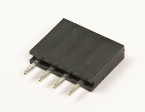

# Step 4: Multimeter Socket

Now we're going to add the 4-pin socket into **P4**. These pins provide
test points where you can connect a voltmeter and ammeter across the
power supply to take power measurements.

A multimeter is a device that allows you to measure voltage and current
in an electrical circuit. With this socket, you can determine the power
consumption of your LameStation.

## Tools Needed

- Soldering iron
- Tape

## Parts Needed

- 1 x 4-pin socket
  

## Instructions

1.  Find the footprint for P4.
    
2.  Install the socket onto the board.
    
3.  You will need to tape this component to the board. It does not
    matter the orientation of this part.
    
4.  Now solder it into place. The pin on the right in this photo is a
    ground pin, and may be a little more difficult to solder.
    
