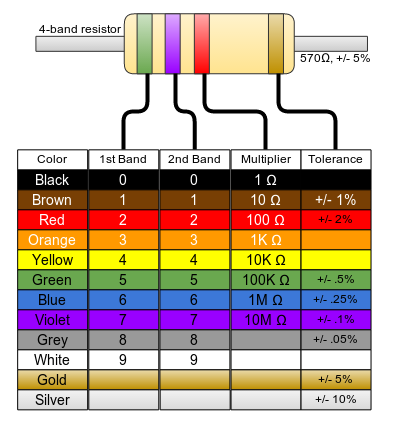
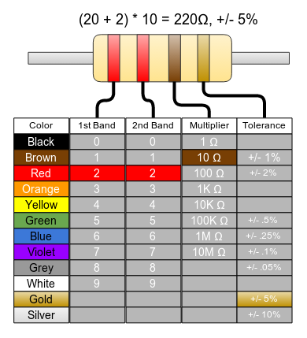
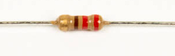

# Step 5: Resistor

You will be installing a 220Ω resistor into **R24**. How do you know
it's 220Ω? It's simple: just read the color codes\!

Color codes are a not-so-intuitive way to determine the value of a
resistor.

So let's check out the resistor in question. How do we know it's 220?

## Tools Needed

- Soldering iron
- Cutters

## Parts Needed

- 1 x 220Ω resistor
  

## Instructions

1.  Find the footprint on the board.

    

2.  Bend the leads as closely as possible at the base, so you can make
    sure it fits on the board without having to force it.

    

    

    

    

3.  Insert the resistor into **R24**.

    !!! info "Resistors are NOT polarized"

        It doesn't matter which direction you install the resistor; it will
        work just the same.\*

        \*That said, it would look nice to have them all
        facing the same direction...

    

4.  Bend the leads outward to help hold the resistor against the
    board.
    

5.  Solder the resistors into place.
    

6.  Trim the leads so that they are flush with the surface.
    
