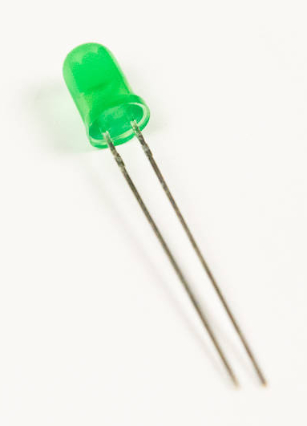

# Step 6: Light-Emitting Diode

This LED will turn on when the board is powered up.

SCHEMATIC OF POWER LED

## Tools Needed

- Soldering iron
- Cutters

## Parts Needed

- 1 x light-emitting diode (LED)

  {: width=150}

## Instructions

1.  You will now be installing an LED to **D1**. Find the footprint for
    D1 on the board. You will notice that it has a flat edge on one side
    of the footprint.

    

2.  Insert the LED into the board. Carefully notice that the LED has the
    same flat edge. You will also notice that one of the **leads**, or
    wires coming out of the LED, is shorter than the other, and the
    shorter one is one the same side as the flat edge. These both
    indicate the negative terminal of the LED.

    

    

3.  Bend the lead wires back and solder away.

    
