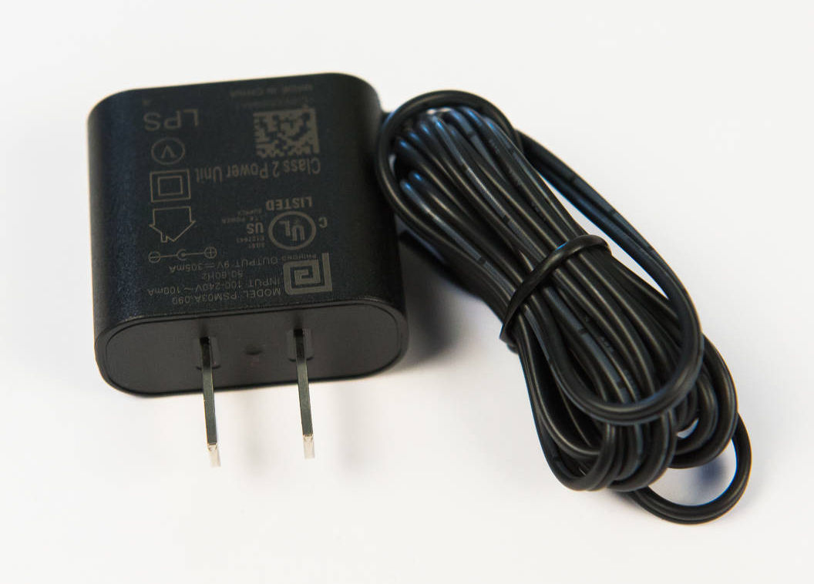

# Step 7: Power-On Test

The green LED does more than just
tell you the board is on. It is also an early warning system that you've
done something horribly wrong. If you've accidentally soldered something
that has created a short in the system, the green LED will not turn on,
since no power can get to it. **This may be the only warning you
have**.

You will do a **power-on test** at
the end of every section as the first test you do. This way, if you do
have a short, you will know that it is the result of something you've
done during the current section, allowing you to troubleshoot it more
easily.

## Parts Needed

- 1 x power adapter

  {: width=200}

## Instructions

When you add a component, the first thing you should do when powering on
the board is watch that green LED. This will reduce the chance of
something being fried on the board as a result of your mishap.

1.  Plug the power adapter into an available wall outlet.

2.  Plug the other end to the DC jack in **J1**.

    

3.  Plug it in, plug it in. Flip the power switch to the left to turn on
    the board. If the light turns on, everything is good to go\!

    !!! danger "Turn off immediately if the LED doesn't come on"

    

This completes the power subsystem, with the exception of the battery
pack, which will be connected later.
