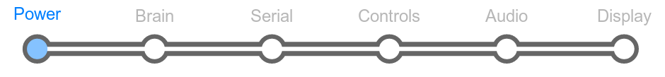

# Section 2: Power

The last section that you did was the first step: adding the DC power
jack. Now that you've gotten a little more familiar with soldering, we
can finish it.

## Overview

The LameStation is powered in one of two ways; using the on-board 4AAA
battery pack or an external DC power supply. You do not need to worry
about conflicts between the two. The LS automatically switches between
the two sources using a shunt switch in the power jack.

The battery pack is a large, plastic obstruction to everything else you
need to assemble, so this is one of the last items to go on the board,
much later.

You will be introduced to a few things here: resistors, capacitors, and
diodes.

### What Is A Resistor?

### What Is A Capacitor?

### What Is A Diode?

## Schematic

## Parts Needed

_(Top
row from left to right)_

- 1 x Green LED
- 1 x 3.3V regulator
- 1 x 5V regulator
- 3 x 100μF capacitors

_(Middle row from left to right)_

- 2 x Metric nut
- 2 x Metric screw
- 1 x Slide switch

_(Bottom row from left to right)_

- 1 x 220Ω resistor
- 1 x 4-pin socket
