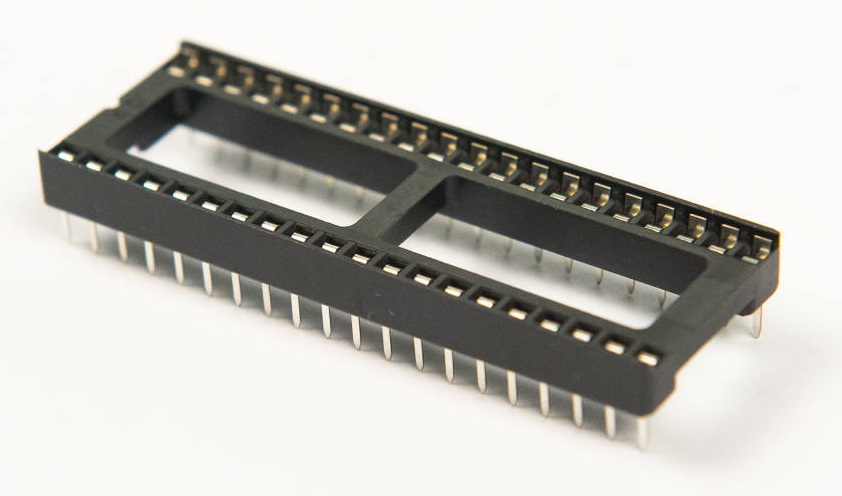
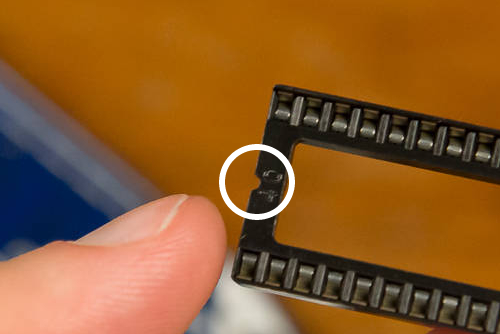
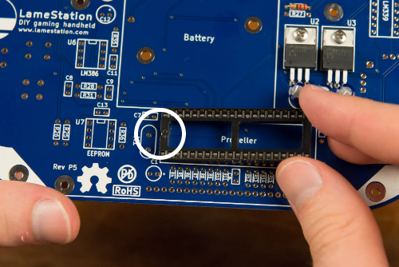

# Step 1: Propeller Socket

You will be installing the 40-pin DIP socket into **U4**; it is the
largest IC socket on the board. This will make a nice, cozy home for the
Parallax Propeller microcontroller.

!!! warning "Only install the sockets"

    Do not install the ICs until instructed to do so.

## Tools Needed

- Soldering iron

## Parts Needed

- 1 x 40-pin DIP socket

  {: width=200}

## Instructions

1.  Find the footprint for U4.
    <!-- (THE PICTURE IS A LITTLE UNCLEAR AROUND THE BOTTOM, NEAR THE REFERENCE DESIGNATOR U4). -->

    

2.  Notice the notch at one end of the socket. This indicates which
    direction the IC goes in.

    

3.  Seat the socket on the Propeller footprint.  Make sure the socket
    notch matches the rectangular notch on the footprint towards the
    left side (closest to X1, C1, and C7).

    

    !!! warning "Don't install the socket backwards"

        While the IC can still fit if the socket is backwards, doing so will
        encourage you to install the IC backwards, which is very, very bad.

4.  Tape the socket into place across the center so that tape touches
    the board on either side of the socket.
    

5.  Make sure that the socket is tight stays flat against the surface
    even when the board is flipped over. With such a large number of
    pins, any mistake in placement will be very difficult to fix once
    you start soldering.
    

6.  Solder two pins at opposite corners of the socket first.
    
    

7.  Now look at it from the side (tape removed for photo).
    

8.  If the socket lays flat against the board, solder the remaining
    corners.
    
    
    If the socket isn't laying flat, remelt one of the corners to
    reposition it.

9.  Now continue soldering all of the pins on the socket.
    

10. Now your board should look like lots of little Hershey's Kisses
    lined up in a row.
    
