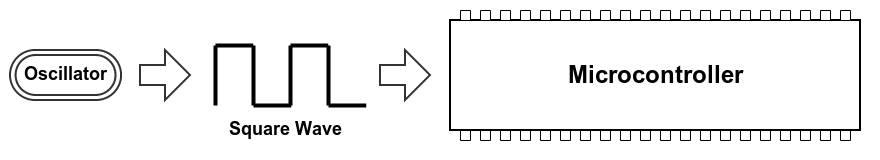
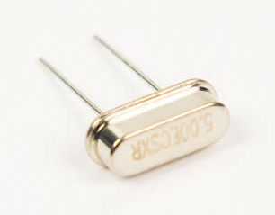

# Step 2: Crystal Oscillator

For a microcontroller to operate, it needs some kind of clock, or way of
keeping time. This can be provided by something called an oscillator.
An **oscillator** is an electronic circuit that produces a periodic
signal, often a sine or square wave.

The chip has an internal oscillator, but it is comparatively slow -
achieving speeds only up to 12MHz on average (8-20MHz) - and less
accurate than a crystal oscillator. With an external oscillator, it can
go all the way to 80MHz. This is important because of how a computer
works. You see, a computer operates only as fast as the clock it is
attached to. The faster the clock, the more code the computer can
process in a second. We want the computer to run as fast as possible so
that we can do more stuff with it\!

**Drawing Sprites With A Fast Clock**

**With A Faster Clock**

This is why we will install a crystal oscillator into **X1**. This is a
tiny, metal, helmet-shaped component that looks something like a jelly
bean jabbed with wires.

## Tools Needed

- Soldering iron
- Cutter

## Parts Needed

- 1 x Crystal oscillator

  {: width=200}

## Instructions

1.  Seat the crystal in the X1 footprint on the board. The direction
    that you install this component does not matter.

    

2.  Bend the lead wires outward to hold the crystal to the board.

    

3.  Solder into place and trim the lead wires.
