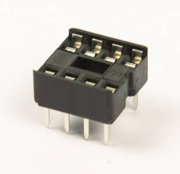
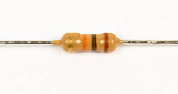
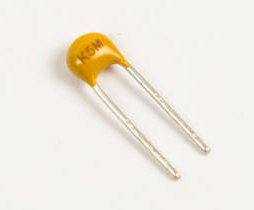

# Step 4: EEPROM Circuit

You will now be installing the **EEPROM**. EEPROM stands for
**Electrically-Eraseable Programmable Read-Only Memory**, which is an
excitingly complicated name for something that stores programs for the
LameStation even when it's turned off. Since that's totally a mouthful,
most people just call it an EEPROM.

## Parts Needed

- 1 x 24LC256 EEPROM
- 1 x 8-pin DIP socket
- 1 x 10kΩ resistor
- 1 x 0.1μF ceramic capacitor

## Instructions

1.  Insert the 8-pin DIP socket into **U7**. This is where the EEPROM
    will sit.

    

2.  Find the footprint for U7.

    

3.  Seat the socket, being mindful of the notch that indicates
    orientation on both the footprint and socket.

    

4.  Tape the 8-pin DIP socket into place.

    

5.  Solder the socket into place. As before, make sure the socket is
    flat against the board. The top-right pins as pictured are all
    ground pins, so they will require more heat to melt. Be patient with
    these pins.

    

6.  Solder a 10kΩ resistor into **R36**. This is a pull-up resistor to
    create a weak high on the SDA line. Press the resistor firmly into place.
     <!-- (picture needs to be updated). (YOU LOST ME HERE ON THE
    REASONING). -->

    

    !!! info "Remember, resistors are not polarized"

        That means you can install them any direction you like.

    

7.  Solder a 0.1uF capacitor into **C13**. This filters noise for the
    EEPROM power.

    
