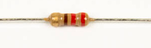
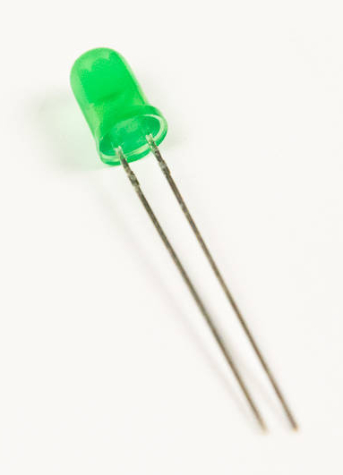

# Step 5: Software LED

In this part, we will add an LED that can be controlled by the
LameStation, giving us our earliest signs of life for the
microcontroller.

This is possible because the LED is connected between a 3.3V power rail
and a Propeller pin. When the Propeller sets the pin to 0V, there is
voltage across the LED, which turns it on. How nifty is that\!

## Tools Needed

- Soldering iron
- Cutter

## Parts Needed

- 1 x 220Ω resistor

  {: width=150}

- 1 x green LED

  {: width=150}

## Instructions

1.  Solder the 220Ω resistor into **R27**. This resistor sets the diode
    voltage for the LED we are about to add.
    
2.  Install the green LED into **D2**.
    
