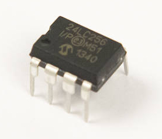
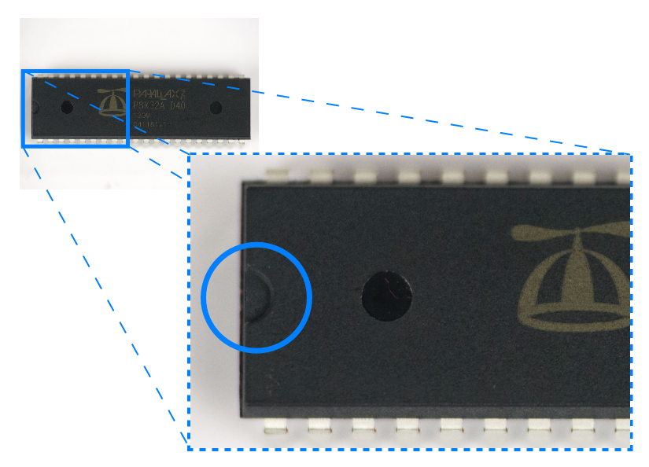
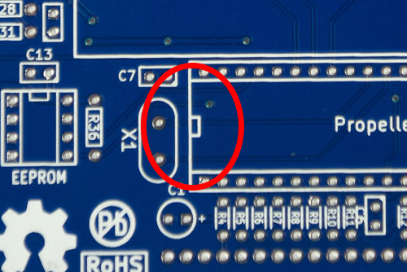
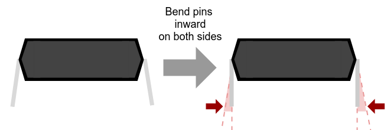

# Step 6: System Test

At this point, it's probably a good idea to seat the EEPROM and
Propeller in their socket to verify that they are functional.

The EEPROM comes pre-programmed with the `ImAlive.spin` program
(`/demos/assembly/ImAlive.spin`), which blinks the [software-controlled
LED](../5-software-led) to show the Propeller is indeed alive.

## Parts Needed

- 1 x Parallax Propeller

  {: width=250}

- 1 x EEPROM

  {: width=150}

## Instructions

1.  First, conduct a [power-on test](../../2-power/7-power-on-test) to
    verify there are no catastrophic problems.

### Installing The Propeller

1.  You will be
    installing the Propeller microcontroller onto the board. This is
    where all the magic happens. The orientation of the
    Propeller, like all ICs, matters. Look for a little tab at one end
    of the chip.

    

    As with the socket, this notch lines up with the notch on the board
    itself.

    

2.  You will discover pretty quickly that IC pins never seem to line up
    exactly with the socket; they are too wide. This is pretty much
    always the case, so the pins must be bent very slightly to
    straighten them out.

    !!! warning "Don't bend the pins too much!"

        If you bend IC pins too many times, they will break off, and then
        you will need a new chip.

    

    

    For large ICs like the Propeller, the easiest way to do this is to
    press one long edge of the IC against the table, and roll the
    pins *gently* inward, until they are perpendicular with the IC body
    (the black part).

    

3.  Seat the Propeller onto the 40-pin DIP socket, with the IC tab on
    the end closest to the crystal. **Don't wedge it in too tight,**
    because you'll need to remove it again later.

    !!! danger "Don't install an IC backwards"

        Doing so usually results in frying the chip completely.

    

    It's best to gradually press the IC on either side. If you apply a
    lot of pressure to seat all pins at once, but come to find your pins
    are misaligned, you may bend and break many pins all at once, so
    don't\!

    

    

    

### Installing the EEPROM

1.  Remove the EEPROM from the foam. The EEPROM and the audio amplifier
    look nearly exactly the same, except for what's written on them.
    This is because many types of circuits can be put into the same form
    factors. The EEPROM will have the number `24LC256` printed on the
    top.

    

2.  Seat the EEPROM in a similar way. However, the chip is too small to
    lay the edge flat on the table easily. It's easier to bend them by
    hand, being careful to line up the pins very carefully.

    

3.  The EEPROM comes pre-programmed with the ImAlive.spin program, which
    can be found in the SDK. Moments after you successfully power on the
    board, you will see the D2 LED blinking; you can call this
    happiness.

    

## Troubleshooting

??? summary "Did you remember to install the Propeller IC?"

    Doh! The Propeller itself is the heart of the system. Without it,
    nothing else does anything.

??? summary "Is the IC seated flat on the board, and not loose?"

    You gotta make sure to seat the Propeller gently but firmly on the
    board, all the way into its socket.

??? summary "Are any of the Propeller IC pins bent?"

    These definitely need to be fixed and quick. If they get bent too much,
    they will weaken and fall off.
