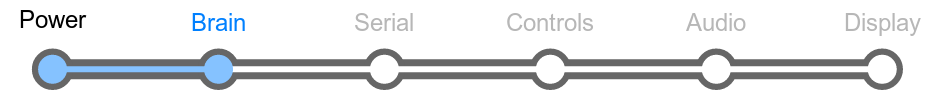
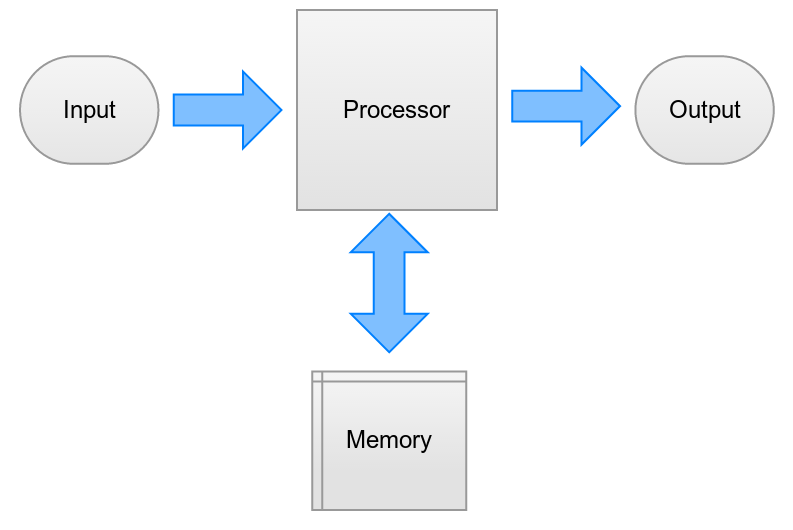
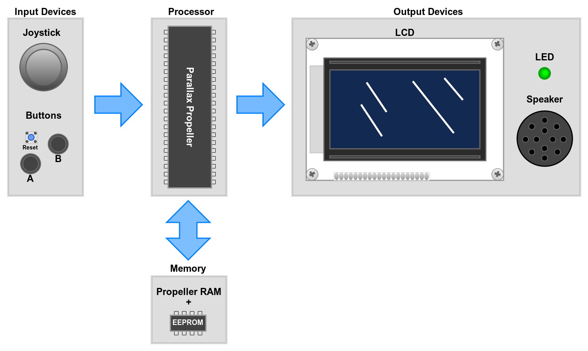

# Section 3: Brain

There are several things that need to happen before this board will do
anything interesting; power, a soul, and a way to communicate. You've
already assembled the power supply, and proven that your board has
power.

Now it's time to make that power do something.

Let's take a step back for a minute. What exactly is a computer? What
does it do? And how? In its most simple form, a **computer** is a device
that takes an input, processes it, and returns an output.

The LameStation is a very simple computer, containing only a few
parts. You'll notice pretty quickly that there seems to be a lot more
output things than input things. Well, how much stuff can you really do
with your hands?

Computers are able to do this because of a beautiful invention called
the transistor.

### Transistors

A **transistor** is like a tiny switch that can be turned on and off
using electricity.

<!--
INSERT PICTURE OF A TRANSISTOR (Is it possible to show a video of a
transistor in action? Or maybe as a learning bit, we can have links to
videos like on youtube. I saw a few good ones but didn't want to post
them here yet).
-->

As it turns out, switches can do very simple things like turning a light
on and off, to very complex things like math calculations and moving
information around.

### Integrated Circuits

Now take those transistors and multiply them by several million (or in
some cases, billion, trillion). Now you have a computer; a vast array of
logic switches that all work together to accomplish very sophisticated
tasks.

This is how computers can do anything at all. With that many switches
though, you can't just wire them together on a table. That'd be pretty
freaking ridiculous\! That's where integrated circuits come in.

An **Integrated Circuit**, or **IC** for short, is a way of packaging an
electronic circuit in a very small size, and these small packages can
hold many billions of transistors. You will often hear people refer to
ICs as **computer chips**, or just **chips**.

### Sockets

**Sockets** are holders for integrated circuits. By using one, you don't
have to worry about overheating the sensitive ICs when you solder them,
and it's easy to replace chips if one is damaged. That's why all of the
ICs in this kit have sockets.

!!! warning "Remove ICs from their sockets before soldering"

    This will save you the headache of accidentally burning (or worse,
    melting) something that you probably would have rather not. Better safe
    than sorry!

## Schematic

## Parts Needed

---

_(Top row from left to right)_

- 1 x Parallax Propeller microcontroller
- 2 x 0.1μF capacitors
- 1 x Green LED

_(Mid row from left to right)_

- 1 x 40-pin DIP socket
- 1 x 5MHz crystal oscillator

_(Bottom row from left to right)_

- 1 x 220Ω resistor

_(Top row from left to right)_

- 1 x 8-pin DIP socket
- 1 x 24LC256 EEPROM
- 1 x 0.1μF capacitor

_(Bottom row)_

- 1 x 10kΩ resistor
