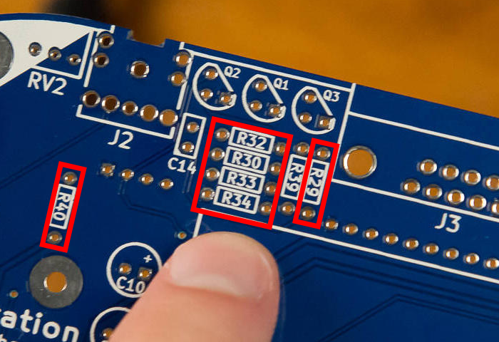
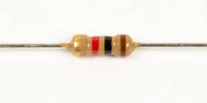

# Step 2: Resistors And Capacitors

## Parts Needed

- 6 x 10kΩ resistors
- 1 x 1kΩ resistor
- 1 x 0.1μF capacitor

## Instructions

1.  You will now be adding the six 10kΩ resistors
    to **R29**, **R30**, **R32**, **R33**, **R34**, and **R40**.

    

2.  Here they are; look at how pretty they are, all taped together.  If
    you try to just yank these apart, you'll probably bend the leads all
    crazy and have to straighten them.

    

    I find the easiest thing to do is just cut the leads short with
    scissors. This will also make it easier to work with them later.
    Start with one side.

    

    Then hold all of the resistors while cutting the other side, so they
    don't fall somewhere to be lost forever.

    

3.  Find the new home for these resistors on the board. Don't
    forget **R40**, which is off by itself on the left\!

    

    Refer to the previous section on how to bend resistor leads for
    insertion.

4.  Add a 1kΩ resistor to **R39**.

    

5.  Find its footprint on the board.

    

    

6.  You remember from before that you need to bend the lead wires to
    keep the resistors from falling out while soldering, but now there
    is a disgusting mess of them sticking out.

    

    No worries\! We can bend them all quickly with a flat-edged tool. I
    recommend a butter knife, nail file, or opposite end of a tweezer.
    Make sure to hold the resistor in place on the opposite side of the
    board, and bend the leads\!

    

    

    When finished, they should look beautiful combed and straight. These
    will hold in place while soldering, and be easier to work the iron
    in between.

    

7.  Solder all of the resistors into place, then trim the leads.

8.  Install and solder the 0.1μF capacitor into **C14**.

    

    

    
