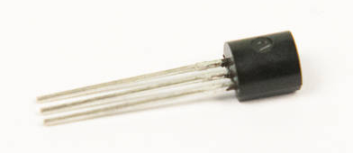
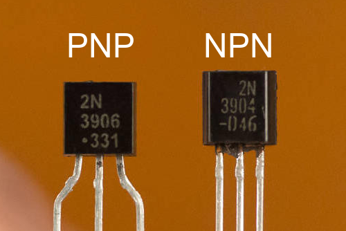

# Step 3: Transistors

You will now be installing NPN transistors to **Q1**, **Q2**, and the
PNP transistor to **Q3**.

## Tools Needed

- Soldering iron
- Cutters

## Parts Needed

- 2 x NPN transistors
- 1 x PNP transistor

## Instructions

1.  Before doing anything here, it's important to correctly identify
    which transistor is which. The NPN transistors will say "3904" on
    their package, while the PNP transistor will say "3906".

    !!! warning "Do not confuse the transistors!"

        If your solder the wrong one in place, **your programming port will
        not work** and you will not be able to use your LameStation for
        anything useful!

    

2.  Find the transistor footprint on the board.

    

3.  You will notice right away that the leads do not fit into the
    footprint. You will need to bend each transistor's leads yourself,
    carefully.

    1.  Slide your thumb nail in between the center pin and the left and
        right pins.
        
    2.  Bend slightly outward, away from the flat edge of the transistor
        package.
        
    3.  Using the tips of your fingers, bend the left and right pins
        outward, away from each other, very slightly.
        
    4.  It should look like this when completed.
        

4.  Seat the transistors on the board.

    - Two NPN transistors will go into **Q1** and **Q2**.
    - One PNP transistor will go into **Q3**.

    You will need to press them into place, which will bend them pins
    slightly further.
    
    They will not sit flush with the board; that's how it's supposed to
    be. They will still be sturdy and hold in place once soldered.
    

5.  Solder the transistors into place.

    !!! danger "Make sure you installed the transistors in the correct position!"

        You will not be able to use your LameStation at all if done incorrectly!

    
