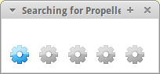

# Step 5: Testing Code Download

In this section, we'll run through a series of short tests to make sure
that the LameStation is able to download code.

## Instructions

1.  The first thing you should do, before you try to program, is test
    and make sure the power still comes on when you power on the board
    like before. If you've already forgotten, see the [power-on
    test](../../2-power/7-power-on-test) for more information.

    

2.  Then comes the pivotal moment when you find out if you did it
    right. This will verify your ability to download code
    to the Propeller. Make sure the board is powered off, then
    install the Propeller **only** back onto the board.

    

3.  Get out the serial programming cable that came with your kit.

    

4.  Plug the USB end of the cable into your development computer.

    

5.  Plug the other end to the serial port on your LameStation.

    

6.  Do *another* power-on test to make sure that there are no shorts.
    Leave the board on for the duration of this step.

7.  [Download and install the LameStation
    SDK](https://github.com/lamestation/lamestation-sdk/releases) if you
    haven't already.

8.  Go to "_File -> Open_":

    

9.  Look in the `demos/assembly/` folder of the LameStation SDK
    (wherever you installed it) and open the `ImAlive.spin` program.

    

10. Press F10 to start code download to the Propeller.

    

    The following box will pop up briefly to indicate the download has
    started.

    

    Please see [Troubleshooting Code
    Download](../../troubleshooting/code-download) if you are
    having problems loading the `ImAlive.spin` program.

11. The resulting blink pattern will be the same as in the previous
    section, when the ImAlive program was loaded off the EEPROM, but
    now, there is no EEPROM. The light is blinking because you
    downloaded the code directly to the Propeller itself.

    

12. Now try turning off the board and turning it back on. You'll notice
    the light has stopped blinking. This is because the code was running
    from memory, and is lost when the board loses power. But fear not!
    You can reload it at any time! Open up SimpleIDE and re-run
    ImAlive, and it will be back and blinking again, good as new!

13. After the test is complete, we should remove the Propeller chip
    again as we explained in [Step 1: IC Extraction](../1-ic-extraction).  We don't want to
    overheat it or damage it when we continue soldering.  Remember to be
    very careful so no pins are bent, and use your ESD foam to protect
    the chip after you remove it.
