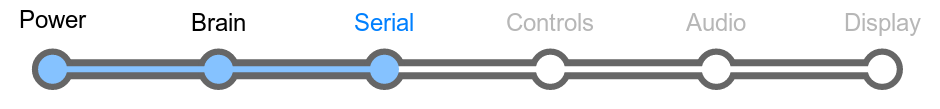

# Section 4: Serial

Okay, you saw the blinking LED. Cool, cool, cool. You're probably bored
of it already though, and if that sounds like you, then you probably
want the LameStation to do something more interesting.

But fear not! You've got power to the board, the brains are in place,
and now all we need is a little more communication.

## Schematic

## Parts Needed

_(Top row)_

- 1 x 9-pin D-Sub connector

_(Middle row from left to right)_

- 1 x PNP transistor
- 2 x NPN transistor
- 1 x 4-pin socket
- 1 x 0.1μF capacitor

_(Resistors)_

- 1 x 1kΩ resistor
- 6 x 10kΩ resistor
