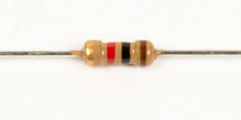

# Step 2: Voltage Ladder

Now we will be adding four 1kΩ resistors to **R16**, **R18**, **R21**,
and **R23**, and two 3kΩ resistors to **R17** and **R22**. Together
these resistors form two voltage ladders, which create threshold
voltages for the comparator.

<!-- INSERT IMAGE OF VOLTAGE LADDER -->

## Tools Needed

- Soldering iron
- Cutter

## Parts Needed

- 4 x 1kΩ resistors

  

- 2 x 3kΩ resistors

  

## Instructions

1.  Find the resistor footprints for the voltage ladder on the board,
    next to the comparator socket.

    

2.  Install the 3k resistors into R17 and R22. These are nestled in
    between other resistors. Don't get them confused\!

    

3.  Then install the 1k resistors into R16, R18, R21, and R23.

    

4.  Bend the leads of all of these resistors and solder them at the same
    time.

    
