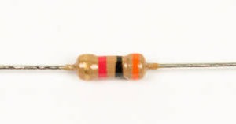

# Step 3: Pull-Up Resistors

You will now be soldering four 3kΩ resistors
to **R1**, **R2**,  **R19**, and **R20**. These are pull-up
resistors to hold the output of the comparator high.

This is because ICs are usually better at sinking current rather then
sourcing.

## Tools Needed

- Soldering iron
- Cutter

## Parts Needed

- 4 x 3kΩ resistors

## Instructions

1.  Find the resistor footprints on the board. R1, R2, R19, and R20 are
    grouped together next to the Propeller socket.

    

2.  Install the resistors into their footprints.

    

3.  Solder them into place.

    
