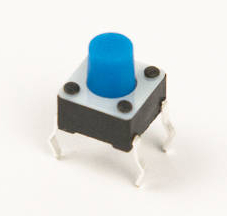

# Step 6: Reset Button

You will now be installing the mini pushbutton switch into **SW4**. This
button is not like the others. It connects to a special circuit that
sends reset signals across the board to the Propeller and LCD
controller.

## Tools Needed

- Soldering iron

## Parts Needed

- 1 x Mini pushbutton switch

  

## Instructions

1.  Find the footprint for SW4.

    

2.  Insert the mini pushbutton switch. This switch will snap into place,
    so no tape is needed.

    

3.  Solder the switch into place.

    
