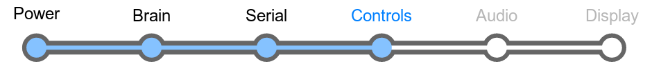
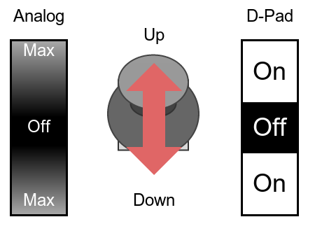
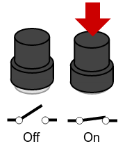

# Section 5: Control

In this section, we assemble the joystick and button controls,
which allow the player to interact with the console.

## Overview

The LameStation provides two different types of controls: joystick and
buttons.

### Joystick

The LameStation incorporates an analog joystick that is configured to
work like a D-pad, or directional pad, on a game controller. Instead of
returning precise position values, it provides only directional values,
making it much easier to use in an application.

To accomplish this, something called a window comparator circuit is
used. By comparing the joystick voltages to reference voltages, clear
on-off signals can be generated.

### Buttons

The buttons used are a very common type of button called a momentary
pushbutton. That means that they close a switch when pressed and open it
again when released.

There is also a reset button, but this one works a little differently.
Instead of being connected to a regular pin, it controls a signal that
causes the whole system to reset, including the Propeller and LCD.

## Schematic

## Parts Needed

- 1 x Joystick potentiometer
- 1 x LM339 quad comparator
- 1 x 14-pin DIP socket
- 6 x 3kΩ resistor
- 4 x 1kΩ resistor
- 1 x 0.1μF capacitor

- 2 x Pushbutton switch
- 2 x 10kΩ resistor
- 1 x Mini pushbutton switch
