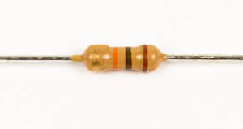

# Step 1: High-Pass Filter

C8 and R28 form a high-pass filter.

## Tools Needed

- Soldering iron
- Cutter

## Parts Needed

- 1 x 10kΩ resistor

  

- 1 x 0.1μF capacitor

  

## Instructions

1.  Solder the 10kΩ resistor into **R28**.

    

2.  Solder the 0.1μF capacitor into **C8**.

    
