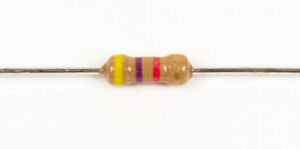

# Step 2: Low-Pass Filter

R31 and C9 form a low-pass filter.

## Tools Needed

- Soldering iron
- Cutter

## Parts Needed

- 1 x 4.7kΩ resistor

  

- 1 x 0.1μF capacitor

  

## Instructions

1.  Solder the 4.7kΩ resistor into **R31**.

    

2.  Solder the 0.1μF capacitor into **C9**.

    <!-- INSERT PICTURE OF CAPACITOR BEING INSERTED INTO PLACE. -->
