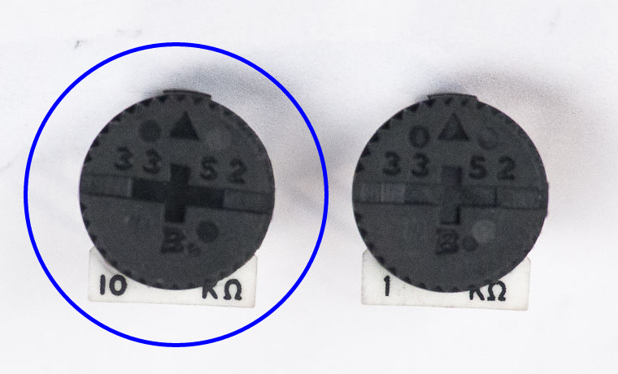

# Step 3: Volume Knob

A 10kΩ potentiometer, or pot for short, provides a volume knob for the
LameStation.

A potentiometer is like a resistor, but it's value can be changed. In
this case, by turning the knob, you can go from 10kΩ all the way to
roughly 0Ω.

<!-- HOW IS THIS A VOLUME KNOB? -->

## Tools Needed

- Soldering iron
- Cutter

## Parts Needed

- 1 x 10kΩ potentiometer

  

## Instructions

1.  Find the footprint for **RV2** on the board.

    

2.  It's very important to use the correct value, especially because
    there is one very similar to this one in the next section. You want
    the 10k.

    

3.  Install the 10kΩ trim pot onto the board.

    

4.  Gently bend the pins in opposite directions so that the part stays
    stuck against the board.

    

    

5.  Solder the trim pot into place.

    

6.  Trim the excess leads with a pair of wire cutters as needed.
