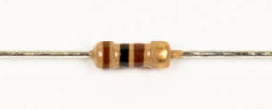

# Step 6: Noise Filter

**R35** and **C11** form a noise filter for the output from the
amplifier.

## Tools Needed

- Soldering iron
- Cutter

## Parts Needed

- 1 x 100Ω resistor

  

- 1 x 0.1μF capacitor

  

## Instructions

1.  Solder the 100Ω resistor into **R35**.

    

2.  Solder the 0.1μF capacitor into **C11**.

    <!-- INSERT A PICTURE OF CAPACITOR BEING INSERTED INTO PLACE. -->
