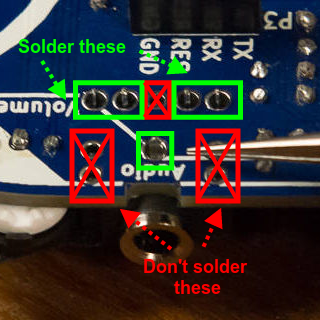

# Step 7: Audio Jack

This audio jack allows you to connect your LameStation to a pair of
headphones or external speakers. When something is connected, this
connector automatically switches off the built-in LameStation speaker
and outputs to this connector, so you don't want power driving a speaker
you don't want to use. Cool, huh?

## Tools Needed

- Soldering iron

## Parts Needed

- 1 x Stereo phone jack

  

## Instructions

1.  Find the footprint for the audio jack at **J2**.

    

2.  Install the audio jack into place; it will fit loosely.

    

3.  Tape generously on either side to prevent the component from lifting
    out.

    

4.  Only solder pads that have pins coming through them. The other holes
    are for plastic knobs that add stability to the connector, but would
    probably smell really terrible if soldered.

    

5.  Solder the audio jack into place.

    
