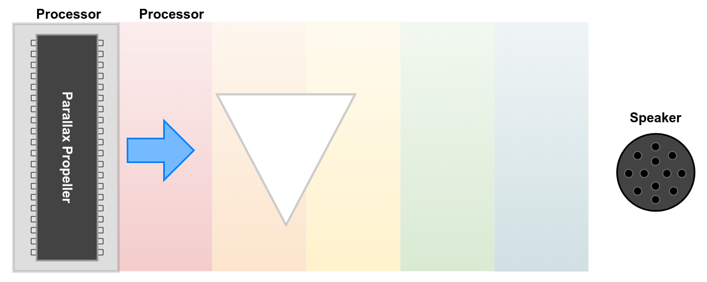
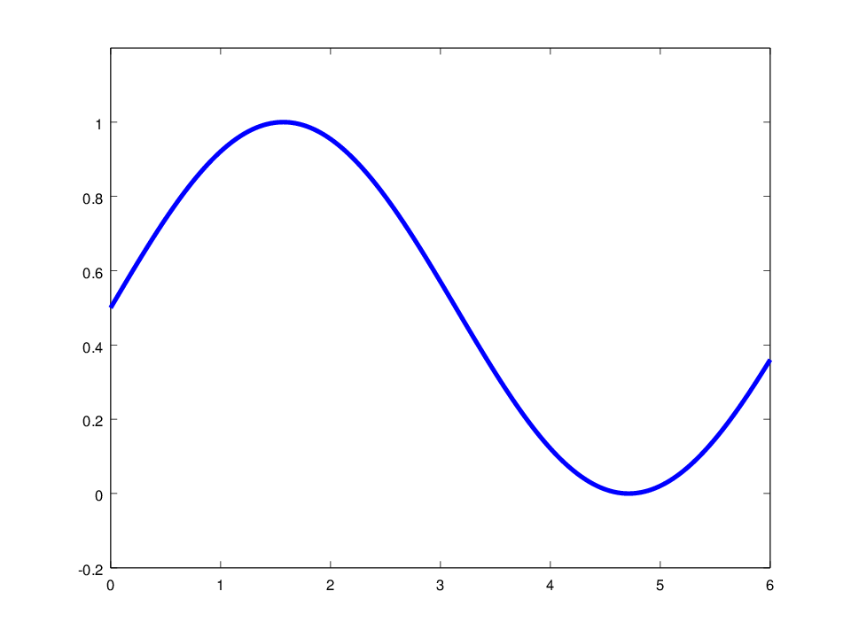
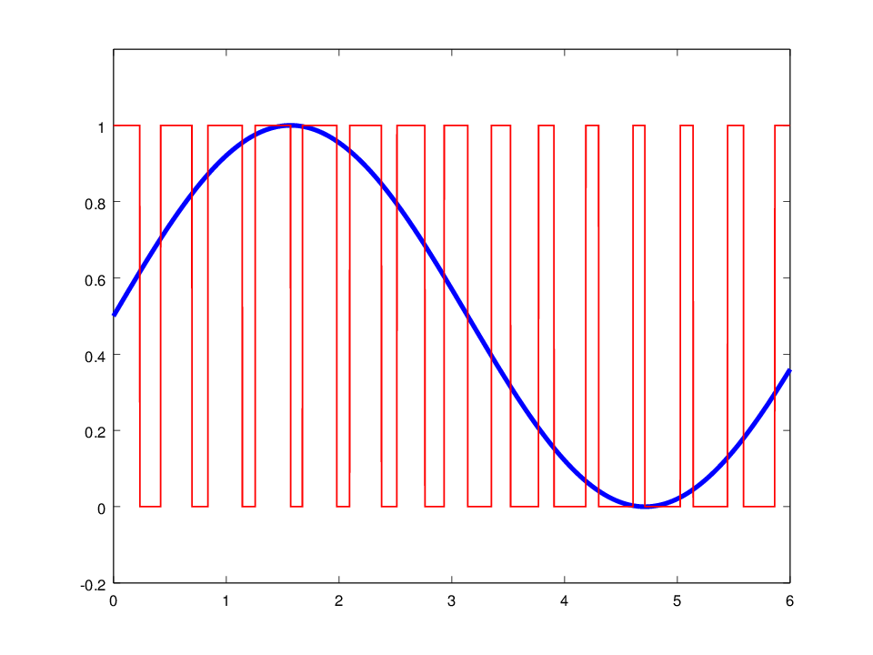

# Section 6: Audio

In this section, you will build a totally awesome amplifier that you can
use to pump some sweet LameStation tunes. Gnarly, bro\!

## Overview

<!-- How it works:  -->

I could have made a very complicated voltage ladder, but that would have
made the board a lot more complex and cost a lot of pins (so no more
expansion port\!)

### The Story So Far

So you'd like to generate a beautiful audio tone from your LameStation.
That's nice.

### Escaping The Processor\!

A computer can only operate on data, ones and zeroes and such, but your
ear can't listen to a bit stream, because that would just sound like
dial-up internet.[^dialup]

[^dialup]:
    For those of you born after dial-up internet,
    listen here: <https://www.youtube.com/watch?v=gsNaR6FRuO0>

There's lots of ways to generate an audio signal electronically, but one
of the simplest is Pulse Width Modulation. That's a fancy way of saying
turn the pin on and off _really, really fast_, depending on the level
of the signal at that moment.

The result is a blocky, horrible-sounding signal that, on average, is
equal to the original waveform.

### Filtering

Two filter average this out to a smooth lower-frequency
signal.

### Controlling Volume

A volume knob behaves like an adjustable voltage ladder,
determining how much of the input voltage reaches the amplifier.

### Pumping It Up\!

An amplifier takes the signal and gives more power to it, so that
it has enough current to drive speakers.

### Another Filter

Another filter reduces noise from the amplifier.

### Eliminating Bias

A large capacitor removes the DC offset, so that the speaker won't
be stressed as much. (more explanation needed)

### Output To The World

The signal is output to either a speaker, or headphones if some
are connected thanks to a small switch inside the jack.

!!! tip "Speakers are magnetic"

    Since the speaker is magnetic, it will pick up small pieces if they
    get too close. If you're missing a capacitor, check the speaker first!

## Schematic

## Parts Needed

- 1 x 8Ω speaker
- 1 x 3.5mm audio jack
- 1 x LM386 audio amplifier
- 1 x 8-pin DIP socket
- 1 x 10kΩ resistor
- 1 x 4.7kΩ resistor
- 1 x 100Ω resistor
- 3 x 0.1μF capacitor
- 2 x 100μF capacitor
- 1 x 10kΩ thumbwheel potentiometer
