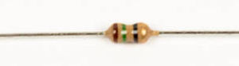

# Step 1: Damping Resistors

You will be installing small 15Ω resistors into **R4-R15**. These
are *damping resistors*. The LCD screen has to update very fast, so the
microcontroller has to send a lot of data very fast. This can create
interference on the line, so these small value resistors are put on each
data line to reduce that noise.

## Tools Needed

- Soldering iron
- Cutter

## Parts Needed

- 12 x Small 15Ω resistors

  

!!! warning "Remove the Propeller chip"

    If you have not done so already, remember to remove the Propeller chip,
    and LM386 chip before you do any soldering.  We don't want to overheat
    them or damage them.

!!! warning "Protect the ICs"

    Remember to place ICs back on the special black foam when not
    seated on the board.

## Instructions

1.  Cut the resistors free, being careful not to bend the leads much.

    

2.  You've already noticed that these resistors are smaller than the
    others.

    

    They work the same way; the LameStation uses smaller ones here to
    pack more of them into a tight space. Nifty, huh?

3.  Install all the resistors into the footprints for R4-R15.

    

4.  Once they're all in, hold them all down with one of your fingers,
    and use a flat edge tool to bend all of the leads at once, and save
    yourself lots of time.

    

    

5.  Now have fun soldering all of these pads.

    

6.  Then trim all the leads.

    

7.  If you got them all straight, then good job, my friend. As you can
    see, I usually have a few that didn't go on quite right. No harm
    done; it will work just the same.

    
