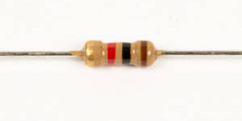

# Step 2: Contrast Knob

This trim pot sets a voltage between two values, and this voltage is
used by the LCD internally to set the contrast.

<!-- INSERT TWO IMAGES WITH TOO DARK AND TOO HIGH CONTRASTS -->

R37, R38, and RV1 set the contrast of the LCD. You'll notice that R37 is
really far away from the other resistors. This is for practical reasons.
This circuit runs all the way across the board so R37 is literally just
somewhere along the way where it would fit. Not every design choice is a
pretty one. 🙂

<!-- INSERT DIAGRAM HIGHLIGHTING TRACES AND HOW THEY TRAVERSE THE BOARD -->

<!-- INSERT DIAGRAM OF CONTRAST KNOB -->

## Tools Needed

- Soldering iron
- Cutter

## Parts Needed

- 1 x 3kΩ resistor

  {: width=150}

- 1 x 1kΩ resistor

  {: width=150}

- 1 x 1kΩ potentiometer

  {: width=150}

## Instructions

1.  Solder the 3kΩ resistor into **R37**.

    

    

2.  Solder the 1kΩ resistor into **R38**.

    

    

3.  Solder the 1kΩ potentiometer into **RV1**.

    
