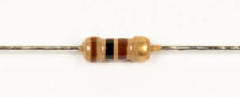

# Step 3: Backlight Power

You will be installing a 100Ω resistor to **R3**. This resistor controls
the amount of current delivered to the LCD backlight, setting the
screen's brightness.

## Tools Needed

- Soldering iron
- Cutter

## Parts Needed

- 1 x 100Ω resistor

  

## Instructions

1.  Install the 100Ω resistor in **R3**.

    

2.  Solder and trim the leads.

    <!-- INSERT PICTURE OF THE TRIMMING OF THE LEADS. -->
