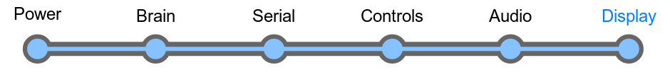

# Section 7: Display

You've been through it all. You've battled the power supply, scrimmaged
the serial port, conquered the controls, and rocked the speakers.

Get ready to activate a little over 8000 lights now. Literally. It's
time to add the display!

## Overview

The LameStation is powered by a KS0108 LCD screen. This is a classy
little LCD with a 128x64 screen and only two possible colors: on or off.
However, the LameStation tricks it out, because the LameGFX library
uses a special technique to generate a third color on this LCD.

Remember how in the audio section,
we toggle a pin up and down really fast and with that, we can create
more complex waveforms? Well, we basically do the same thing with the
LCD. We send data to it really fast, and every single frame, "gray"
pixels are toggled on and off, which results in them being displayed as
another color entirely.

Since we're sending data so fast
over so many lines, signal interference is an issue. So we add lots of
damping resistors which get rid of some of that.

The contrast on this LCD can (and
should) be tuned, using the trim pot RV1. If the circuit only used a
trim pot, the contrast range would be mostly useless, or too high or too
low. R37 and R38 reduce this range, so that it's easier to find a
contrast setting that's nice.

The backlight brightness is
controlled by a single resistor, R3, which simply controls how much
current is delivered to the circuit.

Since the power goes to an
entire module, but power consumption is pretty constant, we add a 10μF
decoupling capacitor, just to be safe, not like the 100μF in the audio
system.

## Schematic

## Parts Needed

- 1 x 128x64 monochrome LCD
- 1 x 20-pin header
- 1 x 20-pin socket
- 1 x 10μF capacitor
- 1 x 1kΩ potentiometer
- 1 x 100Ω resistor
- 1 x 1kΩ resistor
- 1 x 3kΩ resistor
- 12 x 15Ω resistor
- 4 x standoffs
- 8 x screws
