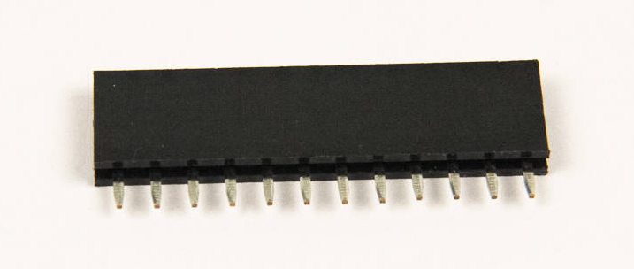

# Step 1: Expansion Port

In this step, you will add a 12-pin header socket into **P2**. With the
expansion port, the sky is the limit. You can do anything you want.
Eight of the Propeller's pins are exposed to the expansion port,
allowing you to take full advantage of a Propeller video generator, or
add an SD card storage expansion, or attach an RF module to control an
airplane. Here's the LameStation being used as a synthesizer\!

<!-- INSERT IMAGE OF LAMESYNTH -->

## Tools Needed

- Soldering iron
- Tape

## Parts Needed

- 1 x 12-pin header socket

  {: width=150}

## Instructions

1.  Install the 12-pin socket into the **P2** footprint.

    

2.  Tape the socket into place.

    

3.  Solder the socket into place.

    !!! info "Soldering 101: Flux"

        There are some places on the board that just won't go on easy, like
        where there are connections to ground so that the heat is
        dissipating more quickly. One thing that will help alleviate your
        troubles is a flux pen; just a quick dab over the trouble joint and
        you'll find that the solder flows into the joint much easier.

    
