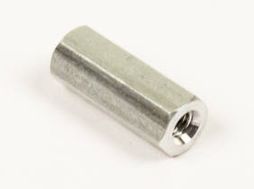
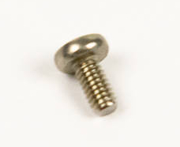

# Step 4: Mounting The LCD

Here, we will add standoffs into the four holes at the corners of the
LCD footprint. This is how the LCD will stay sturdy and attached.

## Tools Needed

- Phillips-head screwdriver

## Parts Needed

- 1 x LCD module

  

- 4 x standoffs

  

- 8 x screws

  

## Instructions

1.  Find the four holes for the LCD standoffs.

    

2.  We need to install the standoffs on the top side of the board, so
    the screw will be inserted on the back, to poke out the front.

    

    

3.  Screw the standoff into place, using your finger to hold the
    screw.

    

    

4.  The standoff should be held firm against the board.

    

5.  Repeat steps 2-4 for the remaining standoffs.

    

6.  Seat the LCD down on its grand throne.

    

7.  Press the LCD down firmly. There will be a small gap in between the
    header and socket; _this is normal_.

    

8.  Use the remaining four screws to securely attach the LCD to its
    standoffs.

    

9.  Now your LCD is securely fastened and ready to enjoy a Lame Ride\!

    
