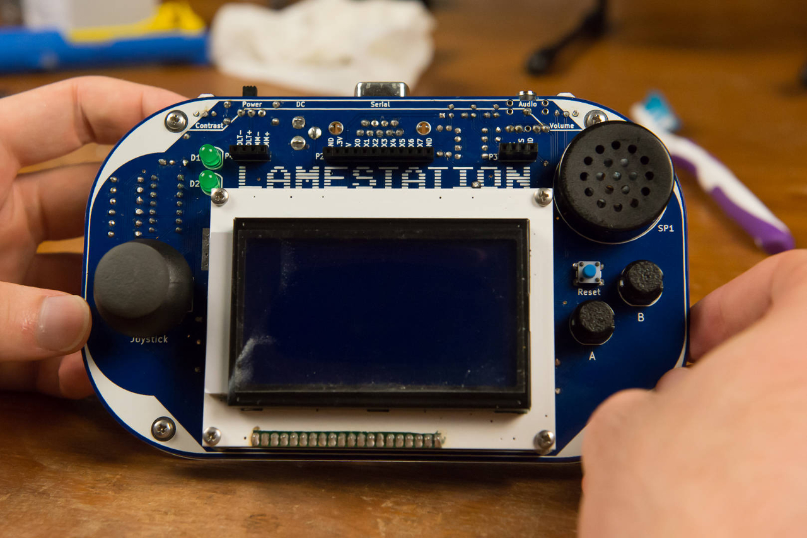

# Step 6: Loading A Game

How awesome is this? Looks like someone just built their very own
LameStation. How cool are you!

{: width=500}

This is the final frontier. Now you get to load your first game onto the
LameStation!

## Instructions

Pick one from the LameStation SDK's `games/` directory. I'm sure you'll
find something good; any one will do. I chose piXel, an exciting action
side-scroller, for my first game.

<figure>
  
  <figcaption>Yeah, woo! I'm having fun!</figcaption>
</figure>

Then you're done\! Get ready for the most fun you've ever had ever when
you get to write your own games for the LameStation\!

## Next Steps

Now that you've finished the assembly, gotten your first game to work,
it's time to do go it on your own and do something cool.

[Program the LameStation](https://github.com/lamestation/lamestation-sdk){: .md-button .md-button--primary }
