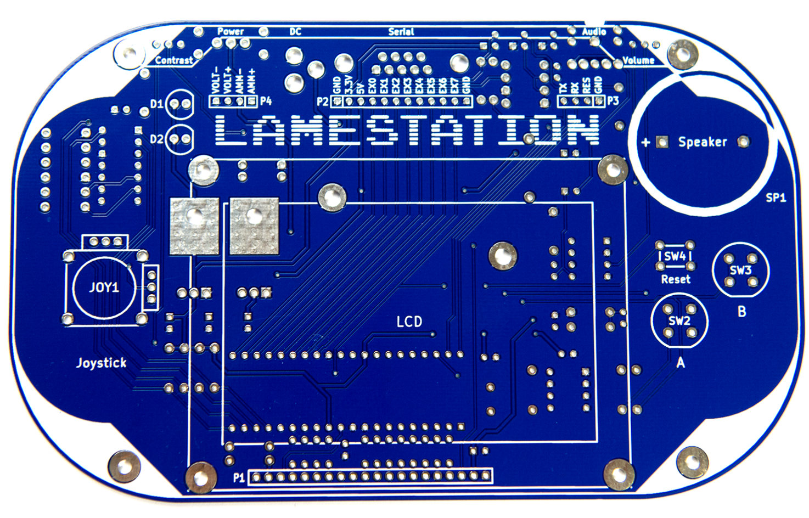
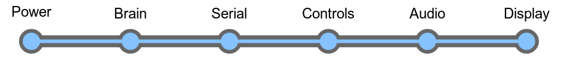
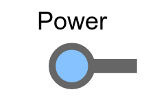
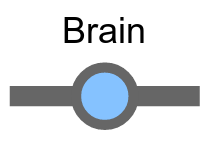
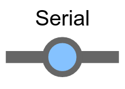
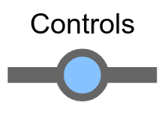
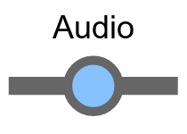
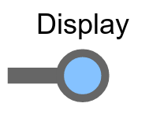
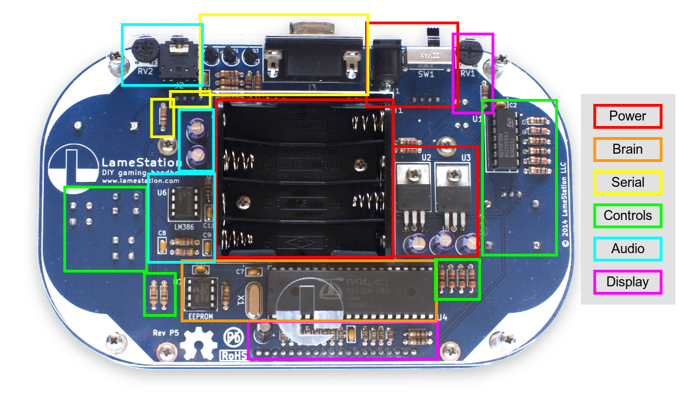

# Assembly Instructions

These instructions will take you from an empty board to fully
assembled LameStation that you built yourself!

## What makes a LameStation?

The LameStation can be divided into six systems or parts. These parts
are power, brain, serial, audio, control, and display.

<!--## What's inside?

This prepares and distributes power from the battery or adapter to be
consumed by the devices on the board.

This is the brain of the LS; the Propeller is the computer on which the
LameStation is built.

This is a communication system by which new software can be loaded onto
the device.

The buttons and joystick that provide all user input.

The system that converts the digital output from the microcontroller to
a smooth audio waveform, then amplifies it and drives a speaker or
headphones.

The entire graphics subsystem up to and including the LCD.
-->

## How is it organized?

Whenever possible, the board itself is organized by subsystem, with
related components grouped together.

## How is this manual organized?

This manual works through the six
systems of the LameStation, installing different parts as needed in a
slow, methodical way that allows you to test your assembly as you build
it.

The manual is divided into eight sections. Each Section page talks about
how the hardware works conceptually, then contains Step pages that walk
through the actual assembly process. Step pages usually require about 45
minutes to complete.

###### [Section 1: Start](1-start/index.md)

Here, we introduce the basics of soldering by adding our very first
component to the LameStation, the power jack.

###### [Section 2: Power](2-power/index.md)

In this section, we introduce the basics of electricity by building a
power supply for the LameStation, which provides electricity to the rest
of the system.

###### [Section 3: Brain](3-brain/index.md)

Here, we discover what makes a LameStation tick, by bringing it's
microcontroller brain to life.

###### [Section 4: Serial](4-serial/index.md)

In this section, we will build a programming interface for the
LameStation, so you can actually load new stuff onto it.

###### [Section 5: Control](5-control/index.md)

In this section, we assemble the joystick and button controls, which
allow the player to interact with the console.

###### [Section 6: Audio](6-audio/index.md)

In this section, you will build a totally awesome amplifier that you can
use to pump some sweet LameStation tunes.

###### [Section 7: Display](7-display/index.md)

In this section, you will see the light―or a little over 8000 lights,
literally―because you will add the display\!

###### [Section 8: Finish](8-finish/index.md)

In this section, you will finish off your LameStation by adding the
battery holder, cover plate, and any other components still left.
