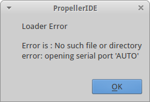
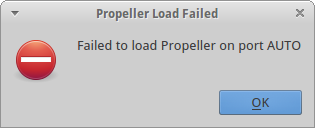
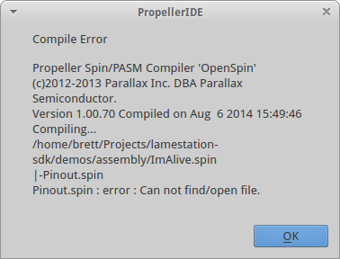
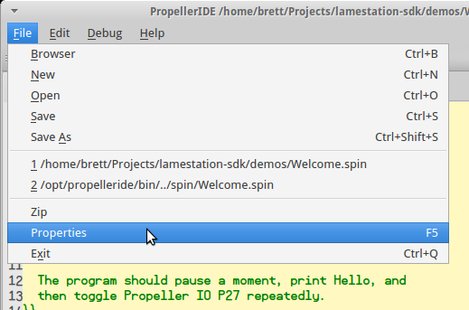

# Troubleshooting Code Download

## error: opening serial port 'AUTO'

 

This error means that PropellerIDE failed to detect any connected
LameStation units.

??? summary "Is the unit powered on?"

    We hate to say it, but this mistake happens to the best of us. Make sure
    your unit is powered on and try to program the unit again.

??? summary "(Linux only) is it a device permission issue?"

    On Linux systems, usually the serial device is restricted to users in
    the `dialout` group, so try adding yourself to that group and then
    rebooting. You will need root access to change groups.

    ```syntaxhighlighter-pre
    usermod -a -G dialout MY_USER_NAME
    ```

## Compile Error : Can not find/open file.



This error means that the program you're trying to load is looking for a
file it needs to run and can't find it.

??? summary "Did you set up the library path?"

    Using the LameStation SDK requires that the PropellerIDE library path be
    set to the LameStation SDK main folder.

    1.  Open PropellerIDE and go to "_File -\> Properties_".
        
    2.  Under the Spin tab, type or browse to the path to where you've
        unpacked the SDK.
        
    3.  PropellerIDE should now be set up for use with the LameStation SDK.
