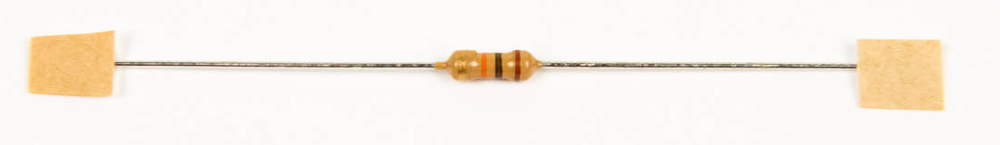

# Parts List

This page details a full list of components used to build the LameStation.

!!! info "Build It Yourself"

    All of these parts can be found online at reasonable prices.

<!-- Add complete BOM -->

## Big Pieces

| Image                                                        | Description           | Qty. |
| ------------------------------------------------------------ | --------------------- | ---- |
| [{: width=100}](images/20578368.jpg) | Printed Circuit Board | 1    |
| [{: width=100}](images/20578369.jpg) | Acrylic Cover Plate   | 1    |
| [{: width=100}](images/13893747.jpg) | Programming Cable     | 1    |
| [{: width=100}](images/13893748.jpg) | Power Adapter         | 1    |

## Integrated Circuits

| Image                                                        | Footprint | Description               | Qty. |
| ------------------------------------------------------------ | --------- | ------------------------- | ---- |
| [{: width=100}](images/13893707.jpg) | U1        | LM339 Quad comparator     | 1    |
| [{: width=100}](images/13893709.jpg) | U4        | Propeller Microcontroller | 1    |
| [{: width=100}](images/13893708.jpg) | U2        | 5V Regulator              | 1    |
| [{: width=100}](images/13893708.jpg) | U3        | 3.3V Regulator            | 1    |
| [{: width=100}](images/13893710.jpg) | U6        | LM386 Audio Amplifier     | 1    |
| [{: width=100}](images/13893710.jpg) | U7        | 32kB EEPROM               | 1    |

## Components

| Image                                                        | Footprint | Description           | Qty. |
| ------------------------------------------------------------ | --------- | --------------------- | ---- |
| [{: width=100}](images/13893715.jpg) | P1        | 128x64 Monochrome LCD | 1    |
| [{: width=100}](images/13893749.jpg) | BT1       | 4AAA battery holder   | 1    |
| [{: width=100}](images/13893719.jpg) | SP1       | Speaker               | 1    |
| [{: width=100}](images/13893713.jpg) | JOY1      | 802 Submini Joystick  | 1    |
| [{: width=100}](images/13893714.jpg) | JOY1      | Thumbstick cap        | 1    |
| [{: width=100}](images/13893718.jpg) | J3        | 9-pin D-Sub Connector | 1    |
| [{: width=100}](images/13893716.jpg) | J1        | DC barrel jack        | 1    |
| [{: width=100}](images/13893717.jpg) | J2        | 3.5mm Audio Jack      | 1    |
| [{: width=100}](images/13893712.jpg) | X1        | 5MHz Crystal          | 1    |

## Switches

| Image                                                        | Footprint | Description            | Qty. |
| ------------------------------------------------------------ | --------- | ---------------------- | ---- |
| [{: width=100}](images/13893720.jpg) | SW1       | Slide Switch           | 1    |
| [{: width=100}](images/13893721.jpg) | SW2, SW3  | Pushbutton Switch      | 2    |
| [{: width=100}](images/13893722.jpg) | SW4       | Mini Pushbutton Switch | 1    |

## Capacitors

| Image                                                        | Footprint               | Description                    | Qty. |
| ------------------------------------------------------------ | ----------------------- | ------------------------------ | ---- |
| [{: width=100}](images/13893724.jpg) | C3-C5, C10, C12         | Capacitor, Electrolytic, 100μF | 5    |
| [{: width=100}](images/13893723.jpg) | C1                      | Capacitor, Electrolytic, 10μF  | 1    |
| [{: width=100}](images/13893725.jpg) | C2, C6-C9, C11, C13-C14 | Capacitor, Ceramic, 0.1μF      | 8    |

## Resistors

| Image                                                        | Footprint                               | Description                | Qty. |
| ------------------------------------------------------------ | --------------------------------------- | -------------------------- | ---- |
| [{: width=100}](images/13893726.jpg) | R3, R35                                 | Resistor, 100Ω, 1/4W       | 2    |
| [{: width=100}](images/13893727.jpg) | R24, R27                                | Resistor, 220Ω, 1/4W       | 2    |
| [{: width=100}](images/13893728.jpg) | R16, R18, R21, R23, R38-R39             | Resistor, 1kΩ, 1/4W        | 6    |
| [{: width=100}](images/13893729.jpg) | R1-R2, R17, R19-R20, R22                | Resistor, 3kΩ, 1/4W        | 6    |
| [{: width=100}](images/13893730.jpg) | R31, R37                                | Resistor, 4.7kΩ, 1/4W      | 2    |
| [{: width=100}](images/13893731.jpg) | R25-R26, R28-R29, R30, R32-R34,R36, R40 | Resistor, 10kΩ, 1/4W       | 10   |
| [{: width=100}](images/13893732.jpg) | R4-R15                                  | Resistor, 15Ω, 1/4W, Small | 12   |
| [{: width=100}](images/13893733.jpg) | RV1                                     | Trim Pot, Linear, 1kΩ      | 1    |
| [{: width=100}](images/13893733.jpg) | RV2                                     | Trim Pot, Linear, 10kΩ     | 1    |

## Transistors

| Image                                                        | Footprint | Description                  | Qty. |
| ------------------------------------------------------------ | --------- | ---------------------------- | ---- |
| [{: width=100}](images/13893734.jpg) | Q1, Q2    | NPN transistor, TO92, 2N3904 | 2    |
| [{: width=100}](images/13893734.jpg) | Q3        | PNP transistor, TO92, 2N3906 | 1    |

## Diodes

| Image                                                        | Footprint | Description     | Qty. |
| ------------------------------------------------------------ | --------- | --------------- | ---- |
| [{: width=100}](images/13893735.jpg) | D1, D2    | LED, 5mm, green | 2    |

## Sockets

| Image                                                        | Footprint | Description        | Qty. |
| ------------------------------------------------------------ | --------- | ------------------ | ---- |
| [{: width=100}](images/13893736.jpg) | U1        | DIP socket, 14-pin | 1    |
| [{: width=100}](images/13893737.jpg) | U4        | DIP socket, 40-pin | 1    |
| [{: width=100}](images/13893738.jpg) | U6, U7    | DIP socket, 8-pin  | 2    |

## Headers

| Image                                                        | Footprint | Description          | Qty. |
| ------------------------------------------------------------ | --------- | -------------------- | ---- |
| [{: width=100}](images/13893739.jpg) | P1        | Header, 1x20, pin    | 1    |
| [{: width=100}](images/13893740.jpg) | P1        | Header, 1x20, socket | 1    |
| [{: width=100}](images/13893741.jpg) | P2        | Header, 1x12, socket | 1    |
| [{: width=100}](images/13893745.jpg) | P3, P4    | Header, 1x4, socket  | 2    |

## Hardware

| Image                                                        | Description  | Qty. |
| ------------------------------------------------------------ | ------------ | ---- |
| [{: width=100}](images/13893742.jpg) | Hex Standoff | 8    |
| [{: width=100}](images/13893743.jpg) | Screw        | 20   |
| [{: width=100}](images/13893744.jpg) | Nut          | 4    |
