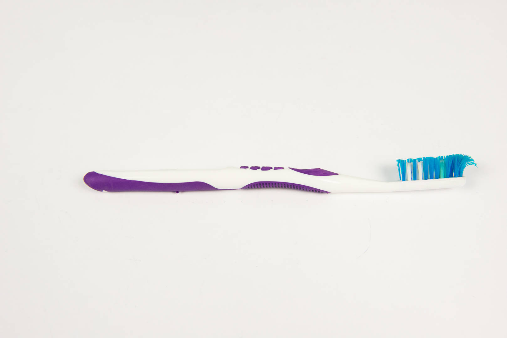
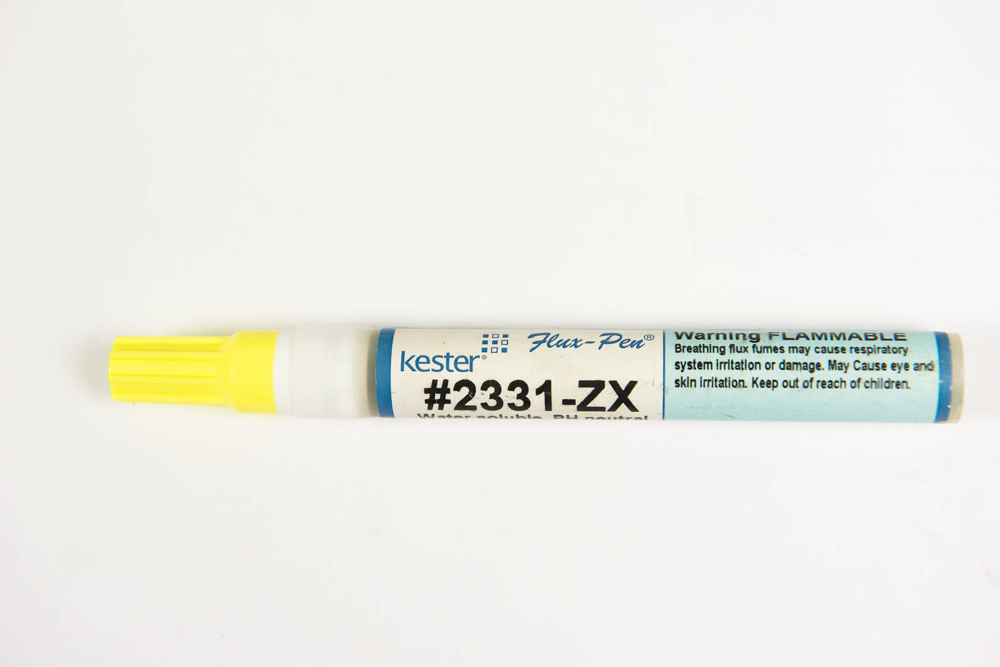

# Tools List

INSERT BEAUTIFUL PICTURE OF WORKSPACE (Take a picture of a beautiful
workspace, with all the tools and equipment nicely laid out.)

## Safety Equipment

### Goggles 

[{: width=300}](images/13893764.jpg)

Solder will splash in ways you never thought possible! Protect
yourself!

### Mask

[{: width=300}](images/mask.jpg)

### Fume Extractor

## Solder Tools

### Soldering Iron 

[{: width=300}](images/20578333.jpg)

[{: width=300}](images/20578339.jpg)

### Solder 

[{: width=300}](images/20578332.jpg)

### Soldering Iron Stand 

[{: width=300}](images/20578334.jpg)

[{: width=300}](images/20578335.jpg)

## Desoldering Tools

These are the tools that you aren't going to need until you need them,
and when you do, you're really going to get your use out of them.

Removing a soldered component is much harder than soldering it in the
first place, because, well, let's face it: you're melting two pieces of
metal together, then trying to undo that. That's a tall order. So see
what's there, and hope you don't have to use these\!

### Solder Sucker 

[{: width=300}](images/20578340.jpg)

### Solder Wick  

[{: width=300}](images/20578336.jpg)

## Cleaning Tools

Flux is awesome because it helps the solder stick to the board.
Unfortunately, in the process, it leaves a thick nasty residue behind
that gets all over your board and eats away at it after awhile. So you
want to clean this stuff up as much as is possible.

Normally, you'd dip the entire board in a cleaning solution when the
assembly is finished, but that would require lots and lots of solution
and is just not that practical. So we're going to clean boards the
low-tech way: with paper towels and a little rubbing alcohol\!

### Rubbing Alcohol 

[{: width=300}](images/20578345.jpg)

!!! danger "Don't sniff the rubbing alcohol!"

    The fumes coming off this thing are surprisingly strong, especially
    since we'll end up using a significant amount of it. Make sure to keep
    your nose clear and only use in a well-ventilated area.

!!! danger "This is flammable!"

    Keep this **AWAY** from the soldering iron and sources of heat or bad
    things will happen!

### Paper Towels 

[{: width=300}](images/20578344.jpg)

This fairly obvious item will be used in the application of the rubbing
alcohol to the board. Other than that, there's nothing too exciting
about it.

### Brush 

[{: width=300}](images/13893760.jpg)

You're going to need a good bristly brush to scrap the cooked-on flux
residue off the board, but you want one that will hold up to this kind
of abuse.

A regular toothbrush actually works just fine for this purpose.

### Sponge 

[{: width=300}](images/20578342.jpg)

This is your first line of defense. You use a wet sponge to wipe soot
and extra solder off your iron, making it easier to work. You're going
to be good friends with this one, and especially like the sizzling sound
it makes when you press the iron to it. Everybody loves that.

### Tip Tinner 

[{: width=300}](images/20578337.jpg)

If wiping the iron on the sponge isn't getting it clean, the next step
is to use a real tip tinner. This fascinating substance takes a very
aggressive clean on your iron, tinning it almost immediately by dabbing
the tip into the container.

### Sanding Sponge 

[{: width=300}](images/20578338.jpg)

If nothing at all else gets your iron tip clean, here is your last
resort: a good manual cleaning. Rub the tip with a fine-grain sanding
sponge and watch the oxidation and black stuff come right off.

## Other Tools

### Screwdriver 

[{: width=300}](images/20578341.jpg)

### Electrical Tape  

[{: width=300}](images/13893758.jpg)

In many cases, the components won't
stay on the board while assembling without a little extra help. That's
where your friend tape comes in. Tape will hold it flat while soldering
and electrical tape will come off cleanly when you're done.

### Wire Cutters 

[{: width=300}](images/13893755.jpg)

You'll be cutting a lot of wires, so you'll need wire cutters.

The best thing you can get are flush cutters; they have a flat edge so
they can cut relatively flat against the board. However, these are a
specialty item and hard to find, so you can use any kind of wire cutter
you can find, or if nothing else, even scissors will do the job.

### Scissors 

[{: width=300}](images/13893753.jpg)

Yes, you heard right. Regular scissors. You're going to need these to
cut the resistors free from their tape, and probably also to cut the
electrical tape. These are used sparingly.

### Flux Pen 

[{: width=300}](images/13893763.jpg)

This is one of those goodies that's nice to have but not strictly
necessary. Use it when you have a particularly stubborn joint that just
can't heat up. Flux will burn any dirt and grease right off the surface
so that it'll be much easier that melt the solder to the pad.

### IC Extractor 

[{: width=300}](images/13893759.jpg)

Have a particularly stubborn IC that you're worried about messing up
when trying to remove it? If you have one of these lying around, it's no
problem. This is the easiest way to remove an appropriately sized
transistor; however, they're not found very often in stores and it's
probably better to learn to live without having one.
