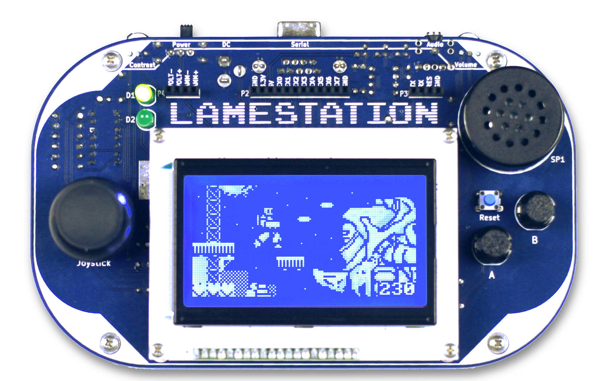
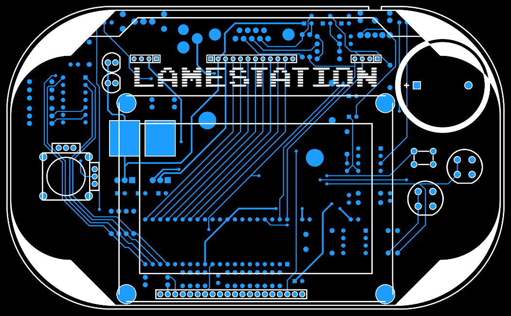

# LameStation LS1

## Tech Specs

### System

The LameStation is powered by the Parallax Propeller

- 8 independent processor cores running at 80MHz.
- 32kB of RAM and ROM.
- High-speed serial programming interface.

### Display

- 128x64 pixels.
- White-on-blue STN LCD in standard kit.
- KS0108 controller with 8-bit parallel bus.
- Adjustable LCD contrast.

### Audio

- PWM output from Propeller.
- LM386 high-gain audio amplifier circuit.
- Switching headphone jack.
- 8Ω speaker.
- Adjustable volume.

_LameStation is a single-channel audio device._

### Controls

- Analog thumbstick with quad comparator circuit to create D-pad like
  configuration.

### Misc.

- 8-pin expansion port direct to Propeller.
- Software-controlled and power-on LEDs for board bring-up.
- PropPlug port and test points for voltage/current.
